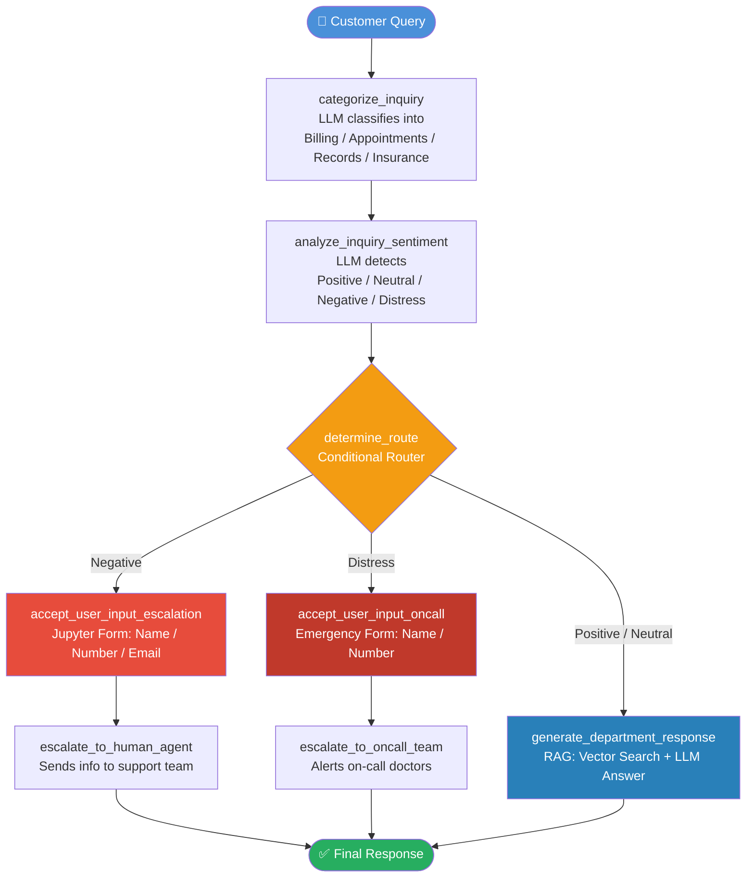
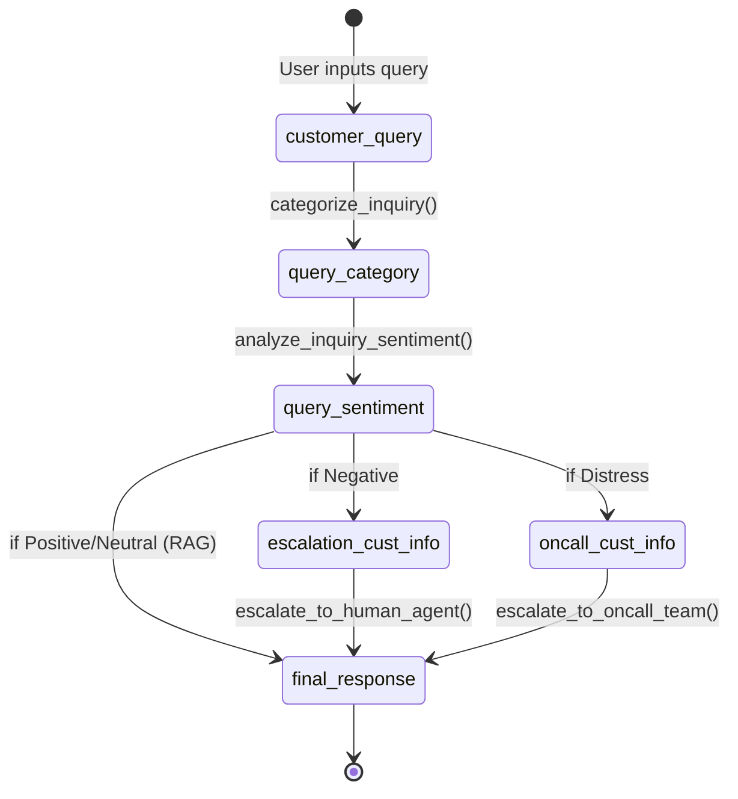
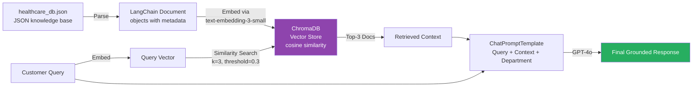
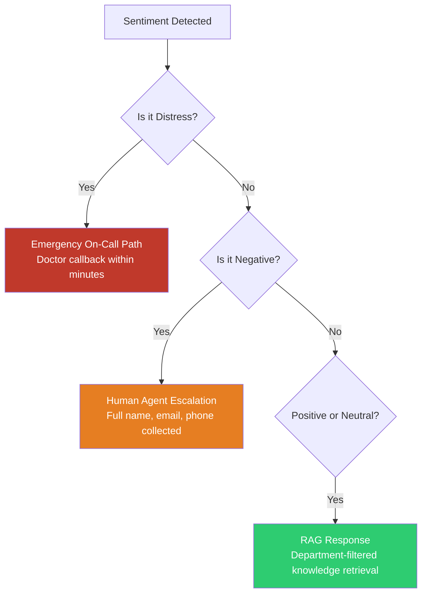

# 🏥 Healthcare Customer Support — Agentic RAG System

> An intelligent, sentiment-aware customer support agent for healthcare services, built with **LangGraph**, **LangChain**, and **ChromaDB**. It routes queries, detects emotional distress, retrieves context-relevant knowledge, and escalates to humans or emergency teams when required.

---

## 📋 Table of Contents

- [Project Overview](#-project-overview)
- [Tech Stack](#-tech-stack)
- [Overall Architecture](#-overall-architecture)
- [Execution Flow](#-execution-flow)
- [Agent State & Data Model](#-agent-state--data-model)
- [Core Concepts & Why They Matter](#-core-concepts--why-they-matter)
- [Node-by-Node Breakdown](#-node-by-node-breakdown)
- [How Calls Happen — End to End](#-how-calls-happen--end-to-end)
- [RAG Pipeline Deep Dive](#-rag-pipeline-deep-dive)
- [Sentiment Routing Logic](#-sentiment-routing-logic)
- [Installation & Setup](#-installation--setup)
- [Usage Examples](#-usage-examples)
- [Project Structure](#-project-structure)
- [Future Improvements](#-future-improvements)

---

## 🔭 Project Overview

This project builds a **production-grade Agentic RAG (Retrieval-Augmented Generation) system** tailored to a healthcare company's customer support function. Unlike traditional chatbots, this system:

- **Understands** what department a query belongs to (Billing, Appointments, Records, Insurance)
- **Detects emotional state** of the customer (Positive, Neutral, Negative, Distress)
- **Retrieves** department-specific knowledge from a vector database
- **Escalates intelligently** — negative queries go to human agents; distress signals trigger emergency on-call doctors
- **Maintains session memory** across multi-turn conversations using LangGraph checkpointing

| Capability | Description |
|---|---|
| 🔀 Query Routing | Classifies queries into 4 healthcare departments |
| 💬 Sentiment Analysis | Detects Positive / Neutral / Negative / Distress states |
| 📚 RAG-based Answering | Retrieves filtered, relevant documents from ChromaDB |
| 🆘 Emergency Escalation | On-call doctor notification for distress signals |
| 👨‍💼 Human Handoff | Form-based escalation to human support agents |
| 🧠 Session Memory | Stateful multi-turn conversation via MemorySaver |

---

## 🛠 Tech Stack

| Layer | Technology | Version |
|---|---|---|
| LLM | OpenAI GPT-4o | Latest |
| Embeddings | OpenAI text-embedding-3-small | Latest |
| Agent Orchestration | LangGraph | 0.3.18 |
| LLM Framework | LangChain | 0.3.20 |
| Vector Store | ChromaDB (via langchain-chroma) | 0.2.2 |
| Structured Output | Pydantic BaseModel | Built-in |
| Notebook UI | ipywidgets + jupyter-ui-poll | Latest |
| Runtime | Google Colab / Jupyter Notebook | — |

---

## 🏗 Overall Architecture

The system is composed of three distinct layers that work in sequence:

```
┌─────────────────────────────────────────────────────────────────────┐
│                      CUSTOMER INPUT LAYER                           │
│              Customer types a query in the notebook UI              │
└─────────────────────────────┬───────────────────────────────────────┘
                              │
                              ▼
┌─────────────────────────────────────────────────────────────────────┐
│                     AGENTIC ORCHESTRATION LAYER (LangGraph)         │
│                                                                     │
│   ┌──────────────────┐      ┌──────────────────────────────────┐   │
│   │ categorize_inquiry│─────▶│  analyze_inquiry_sentiment       │   │
│   │  (LLM + Pydantic) │      │  (LLM + Pydantic)               │   │
│   └──────────────────┘      └──────────────┬───────────────────┘   │
│                                            │                        │
│                               ┌────────────▼────────────────┐      │
│                               │     determine_route()        │      │
│                               │  (Conditional Edge Router)  │      │
│                               └──┬──────────┬──────────┬────┘      │
│                    Negative ──────┘          │          └── Positive/│
│                                             │ Distress     Neutral  │
│                    ┌───────────────┐   ┌────▼──────────┐   ┌──────▼┐│
│                    │  Escalation   │   │  On-Call      │   │  RAG  ││
│                    │  Form + Agent │   │  Emergency    │   │  Node ││
│                    └───────────────┘   └───────────────┘   └───────┘│
└─────────────────────────────────────────────────────────────────────┘
                              │
                              ▼
┌─────────────────────────────────────────────────────────────────────┐
│                     KNOWLEDGE RETRIEVAL LAYER                        │
│                                                                     │
│   Healthcare KB (JSON) ──▶ LangChain Documents ──▶ ChromaDB        │
│   Cosine Similarity Search with Metadata Filtering (category-based) │
└─────────────────────────────────────────────────────────────────────┘
```

---

## 🔄 Execution Flow

The full end-to-end execution is represented below as a LangGraph state machine:



---

## 🧩 Agent State & Data Model

LangGraph is stateful — every node reads from and writes back to a shared **`CustomerSupportAgentState`** TypedDict:

```python
class CustomerSupportAgentState(TypedDict):
    customer_query: str          # Raw query from the user
    query_category: str          # Output of categorize_inquiry node
    query_sentiment: str         # Output of analyze_inquiry_sentiment node
    escalation_cust_info: dict   # Form data for human agent escalation
    oncall_cust_info: dict       # Form data for emergency on-call
    final_response: str          # The final message shown to the customer
```

Each node receives the full state and returns only the fields it updates — LangGraph merges partial updates automatically.



---

## 🧠 Core Concepts & Why They Matter

### 1. 🤖 Agentic AI (LangGraph State Machine)

**What it is:** Instead of a single LLM call, the system orchestrates multiple specialized LLM calls as a directed graph of nodes.

**Why it matters:** Each node has a single responsibility (categorize, sentiment, respond). This makes the system modular, debuggable, and extensible. Adding a new support pathway (e.g., Pharmacy queries) means adding a single node — not rewriting everything.

---

### 2. 📚 Retrieval-Augmented Generation (RAG)

**What it is:** Before generating a response, the system retrieves the most relevant documents from ChromaDB and injects them into the LLM prompt.

**Why it matters:** LLMs hallucinate when they don't have grounded information. RAG anchors answers in your actual knowledge base — the vector store acts as a long-term, searchable memory that the LLM can't hallucinate away.

```
Query ──▶ Embed (text-embedding-3-small)
       ──▶ ChromaDB (cosine similarity, k=3, threshold=0.3)
       ──▶ Retrieved Docs injected into ChatPromptTemplate
       ──▶ GPT-4o generates a grounded response
```

---

### 3. 🗂 Metadata-Filtered Vector Search

**What it is:** ChromaDB retrieval is filtered by the `category` metadata field (e.g., `{"category": "billing"}`).

**Why it matters:** Without filtering, a billing query could accidentally retrieve appointment-related documents. Metadata filtering ensures the retrieved context is always topically aligned to the classified department — improving answer precision significantly.

---

### 4. 📐 Structured Output with Pydantic

**What it is:** LLM responses for classification tasks are constrained using `llm.with_structured_output(PydanticModel)`.

**Why it matters:** Raw LLM text is unpredictable. Pydantic models enforce exact values — `Literal['Billing', 'Appointments', 'Records', 'Insurance']` — making downstream routing 100% reliable. No string parsing, no edge cases.

```python
class QueryCategory(BaseModel):
    categorized_topic: Literal['Billing', 'Appointments', 'Records', 'Insurance']

class QuerySentiment(BaseModel):
    sentiment: Literal['Positive', 'Neutral', 'Negative', 'Distress']
```

---

### 5. 🔀 Conditional Edge Routing

**What it is:** LangGraph's `add_conditional_edges()` allows the graph to branch dynamically based on runtime state values.

**Why it matters:** This is what makes the system "agentic" — it doesn't follow a linear script. Based on detected sentiment, it decides at runtime which path to take, mimicking human decision-making in support workflows.

---

### 6. 💾 Session Memory (MemorySaver)

**What it is:** LangGraph's `MemorySaver` checkpoint persists state between streaming events in a session.

**Why it matters:** Users expect their support interactions to be coherent across messages. MemorySaver ensures that session context (like a partially-filled form or prior conversation turn) is not lost between steps.

---

### 7. 🎛 Human-in-the-Loop (HITL)

**What it is:** For Negative and Distress sentiments, the system pauses execution, renders interactive Jupyter forms, and collects user input before continuing.

**Why it matters:** Not all support queries should be handled by AI alone. Sensitive situations (unhappy customers, medical emergencies) require human judgment. HITL ensures graceful handoffs to the right human expert at the right time.

---

## 🔬 Node-by-Node Breakdown

```mermaid
graph LR
    subgraph Node1 [categorize_inquiry]
        N1A[Read customer_query from state]
        N1B[Prompt LLM with ROUTE_CATEGORY_PROMPT]
        N1C[Structured output: QueryCategory]
        N1D[Return query_category to state]
        N1A --> N1B --> N1C --> N1D
    end

    subgraph Node2 [analyze_inquiry_sentiment]
        N2A[Read customer_query from state]
        N2B[Prompt LLM with SENTIMENT_CATEGORY_PROMPT]
        N2C[Structured output: QuerySentiment]
        N2D[Return query_sentiment to state]
        N2A --> N2B --> N2C --> N2D
    end

    subgraph Node3 [generate_department_response]
        N3A[Read category + query from state]
        N3B[Apply metadata filter to ChromaDB]
        N3C[Retrieve top-3 docs via cosine similarity]
        N3D[Inject docs into ChatPromptTemplate]
        N3E[LLM generates response]
        N3F[Return final_response to state]
        N3A --> N3B --> N3C --> N3D --> N3E --> N3F
    end

    subgraph Node4 [Escalation Path]
        N4A[Render Jupyter form: Name/Number/Email]
        N4B[Block until user submits]
        N4C[Store in escalation_cust_info]
        N4D[Generate sorry response with contact info]
        N4A --> N4B --> N4C --> N4D
    end

    subgraph Node5 [Emergency Path]
        N5A[Render Emergency form: Name/Number]
        N5B[Block until user submits]
        N5C[Store in oncall_cust_info]
        N5D[Generate urgent escalation response]
        N5A --> N5B --> N5C --> N5D
    end
```



---

## 📞 How Calls Happen — End to End

Here's the exact sequence of API and internal calls for a **normal query** (Positive/Neutral sentiment):

```
1. User calls call_support_agent(agent, prompt, user_session_id)
        │
        ▼
2. LangGraph streams initial state: { customer_query: "..." }
        │
        ▼
3. [NODE] categorize_inquiry()
   └── OpenAI API call (GPT-4o) with ROUTE_CATEGORY_PROMPT
   └── with_structured_output(QueryCategory) → returns { categorized_topic: "Billing" }
   └── Updates state: { query_category: "Billing" }
        │
        ▼
4. [NODE] analyze_inquiry_sentiment()
   └── OpenAI API call (GPT-4o) with SENTIMENT_CATEGORY_PROMPT
   └── with_structured_output(QuerySentiment) → returns { sentiment: "Neutral" }
   └── Updates state: { query_sentiment: "Neutral" }
        │
        ▼
5. [ROUTER] determine_route()
   └── Reads query_sentiment → "Neutral"
   └── Routes to: generate_department_response
        │
        ▼
6. [NODE] generate_department_response()
   └── Reads query_category → "Billing"
   └── Sets metadata_filter = { "category": "billing" }
   └── ChromaDB similarity search (text-embedding-3-small → cosine, k=3, threshold=0.3)
   └── Retrieves top-3 relevant documents
   └── Builds ChatPromptTemplate with retrieved context
   └── OpenAI API call (GPT-4o) → generates final answer
   └── Updates state: { final_response: "..." }
        │
        ▼
7. Graph reaches END node
   └── call_support_agent() displays final_response to user
```

For **Negative sentiment**, steps 3–5 are the same, but step 6 becomes:
```
6a. [NODE] accept_user_input_escalation() → blocks on Jupyter form
6b. [NODE] escalate_to_human_agent() → formats and returns apology + contact promise
```

For **Distress**, steps 3–5 are the same, but step 6 becomes:
```
6a. [NODE] accept_user_input_oncall() → blocks on Emergency Jupyter form
6b. [NODE] escalate_to_oncall_team() → formats urgent doctor callback message
```

---

## 📦 RAG Pipeline Deep Dive



**Key RAG parameters:**

| Parameter | Value | Effect |
|---|---|---|
| Embedding Model | `text-embedding-3-small` | Balances cost and quality |
| Distance Metric | Cosine Similarity | Robust to document length variation |
| Top-K | 3 | Retrieves 3 most relevant chunks |
| Score Threshold | 0.3 (30%) | Filters low-relevance results |
| Metadata Filter | `{"category": "<dept>"}` | Restricts search to relevant department |

---

## 🎭 Sentiment Routing Logic



**Distress examples:** `"I am unable to breathe"`, `"Having chest pain"`, `"Emergency"`
**Negative examples:** `"This is unprofessional"`, `"I'm fed up"`, `"Terrible service"`
**Neutral/Positive examples:** `"Where can I get my invoice?"`, `"How do I book an appointment?"`

---

## ⚙️ Installation & Setup

### Prerequisites

- Python 3.9+
- OpenAI API key
- Google Colab or local Jupyter environment

### Installation

```bash
pip install langchain==0.3.20
pip install langchain-openai==0.3.9
pip install langchain-community==0.3.20
pip install langgraph==0.3.18
pip install langchain-chroma==0.2.2
pip install ipywidgets
pip install jupyter-ui-poll==1.0.0
```

### Environment Setup

```python
import os
from getpass import getpass

os.environ["OPENAI_API_KEY"] = getpass("Enter your OpenAI API key: ")
```

### Download the Knowledge Base

```python
# In Google Colab
!gdown 1_bQj7VkXDMwwqJmspFgRzH2mgK1CVMUY
```

### Build the Vector Store

```python
from langchain_openai import OpenAIEmbeddings
from langchain_chroma import Chroma
import json

with open("/content/healthcare_db.json", "r") as f:
    knowledge_data_base = json.load(f)

# Process into LangChain Documents
processed_docs = [Document(metadata=d['metadata'], page_content=d['text']) 
                  for d in knowledge_data_base]

# Create ChromaDB vector store
kbase_db = Chroma.from_documents(
    documents=processed_docs,
    embedding=OpenAIEmbeddings(model='text-embedding-3-small'),
    collection_metadata={"hnsw:space": "cosine"},
    persist_directory="./knowledge_base"
)
```

---

## 🧪 Usage Examples

### Standard Knowledge Query

```python
uid = 'customer_001'
query = "Where can I get my invoice?"
call_support_agent(agent=compiled_support_agent,
                   prompt=query,
                   user_session_id=uid,
                   verbose=True)
# → Routes to Billing department → RAG retrieval → LLM answer
```

### Medical Emergency (Distress)

```python
uid = 'patient_emergency_001'
query = "I am unable to breathe properly, need help"
call_support_agent(agent=compiled_support_agent,
                   prompt=query,
                   user_session_id=uid)
# → Detects Distress → Emergency form appears → On-call doctor alerted
```

### Unhappy Customer (Negative)

```python
uid = 'customer_complaint_001'
query = "This is very unprofessional behaviour from you"
call_support_agent(agent=compiled_support_agent,
                   prompt=query,
                   user_session_id=uid)
# → Detects Negative → Escalation form appears → Human agent notified
```

---

## 📁 Project Structure

```
healthcare-agentic-rag/
│
├── healthcare_customer_support_agentic_rag_system_project.ipynb
│   ├── Section 1: Package Installation
│   ├── Section 2: Data Loading & Document Processing
│   ├── Section 3: ChromaDB Vector Store Setup
│   ├── Section 4: Agent Node Functions
│   │   ├── categorize_inquiry()
│   │   ├── analyze_inquiry_sentiment()
│   │   ├── generate_department_response()
│   │   ├── accept_user_input_escalation()
│   │   ├── escalate_to_human_agent()
│   │   ├── accept_user_input_oncall()
│   │   └── escalate_to_oncall_team()
│   ├── Section 5: LangGraph Compilation
│   │   ├── StateGraph definition
│   │   ├── Node registration
│   │   ├── Edge + conditional edge setup
│   │   └── MemorySaver checkpoint
│   └── Section 6: Test Scenarios
│
├── knowledge_base/            # Persisted ChromaDB vector store
└── healthcare_db.json         # Source knowledge base (downloaded)
```

---

## 🚀 Future Improvements

| Improvement | Description |
|---|---|
| 🌐 Web UI | Replace Jupyter widgets with a FastAPI + React frontend |
| 📱 WhatsApp Integration | Use Twilio API to notify agents and on-call doctors in real time |
| 🔁 Conversation History | Extend MemorySaver to persist across sessions (Redis/PostgreSQL) |
| 🧾 Appointment Booking | Add a real booking tool node that calls a calendar API |
| 📊 Observability | Integrate LangSmith for tracing and prompt monitoring |
| 🔐 PII Masking | Add a PII redaction layer before sending queries to external APIs |
| 🧪 Evaluation | Build a RAG evaluation pipeline using RAGAS framework |
| 🌍 Multi-language | Add a language detection node and multilingual prompt variants |

---


## 📄 License

This project is for educational and demonstration purposes. Feel free to fork and extend.
This project is for educational purposes. Feel free to use and adapt it for your own learning.


---

## 🙏 Acknowledgements

- [LangChain](https://langchain.com/) — LLM application framework
- [LangGraph](https://langchain-ai.github.io/langgraph/) — Stateful agent orchestration
- [ChromaDB](https://www.trychroma.com/) — Open-source vector database
- [OpenAI](https://openai.com/) — GPT-4o and text-embedding-3-small models

---

<div align="center">

**Built with ❤️ for intelligent, empathetic healthcare support**


</div>
